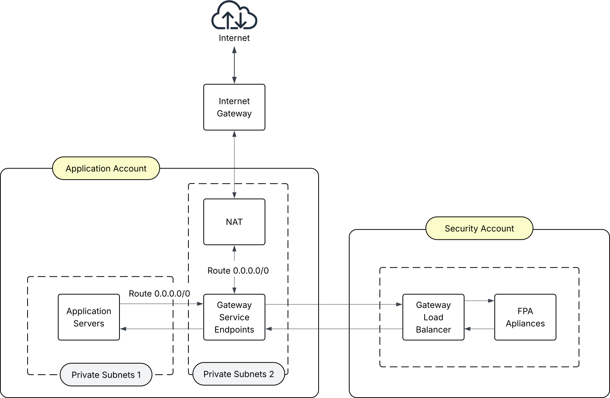

#     <span style="color:midnightblue">**Forward Proxy Appliance**</span>

## Why use it?

- You want to improve your security posture by reducing your attack surface when an EC2 instance, ECS container or EKS Pod are compromised by an attacker.  

- You want an AWS aware configuration that doesn’t require manual intervention for every instance, container or pod startup.

- You want to ensure the proxy configuration is not configurable from within your application accounts.

- You want to be able to configure VPCs with overlapping CIDR blocks.

- You don’t want any peering limits.

- You want support for http as well as https. 

- You want support for different ports and transports 

## What is it? 

- This is a forward proxy appliance that is configurable using host groups and domains in a separate security account behind a service endpoint and gateway load balancer. Instance, containers and pods are configured with metadata tags to select host profiles for internet access.

- Each application account will have their private outbound networked appliance traffic routed through the service endpoint for filtering. The proxy is transparent.  

- The proxy is low maintenance as host profiles can be tagged or in the case of pods annotated to a specific host profile to allow access to curated list of domains.

- When an instance, container or pod starts up for the first time a simple notification API can be used to configure the proxy to allow outbound connections. This allows for automated access based on profiles. 

- The appliances are clustered and with minimal configuration will gather configuration information across all your accounts. The cluster manages this from a single node reducing the number of AWS API requests and allowing horizontal cluster scale ability. 

## How is this usually addressed?

- Block all outbound access and manually configure security group rules for a selected websites. For common site access to enable automated patching for example push access to monitoring and logging sites configure this for each specific instance type. Isolate the instances to specific security groups and manage the instances and security group mapping manually. This approach is difficult and time intensive to maintain also prone to errors. 

- Configure a security group to allow access to all outbound traffic. For a compromised instance, container or pod, this allows an attacker to phone home and orchestrate an attack on your application. 

## Other less commonly used approaches

- Use Squid and manually configure each subnet and host name. This will be either too wide or require intensive amounts of labour. Most likely for EC2 Auto Scaling Groups,  ECS containers and EKS pods will be difficult to maintain and will cause production issues.  

- Configure the instance firewall. If the instance is fully compromised this can be disabled by an attacker.

# Release Notes

## Support 

- Please log all support issues here - [issues](https://github.com/Altihex/Forward-Proxy-Appliance/issues)

- For further support enquiries  email: support@altihex.com


## Restrictions

- No support for the Indian market at present. This will be addressed in the future.

- Currently only the following instance types are supported for the appliance:

  - t3.large

  - t3a.large

  - m5.large

  - m5a.large


- Inbound connections are **not** supported as this is a forward proxy.

- **Only** IPv4 is supported at present. IPv6 is **not** supported with this release. It is on the road-map for a future release.


- Encrypted SNI / ECH **must** be disabled with TLS 1.3 connections. This could be a privacy issue for your users, if so this proxy is not the solution you need. 


## Basic Account Design

The appliance is run as part of a private link / endpoint service with a gateway load balancer, with multiple  consumer accounts. 




### Consumer account 

This requires two sets of private subnets. The primary subnet will have all the instances / containers and pods deployed on them. The primary subnets will be routed to the local service endpoints using the  second subnet for the private link service using route 0.0.0.0/0. The second private subnet routes all traffic on to the NAT Gateway after it returns from the Gateway Load Balancer.


### Proxy processes


Each FPA instance needs to be uniquely tagged using the **altihex-FPA-cluster-node** key and name. The name is used for unique cloudwatch log group names. If don't set the cluster quorum to at least three, then each cluster node will be a controller.  Notifications will fail, as a single node cluster will not send out notifications to the other nodes.  The notifications API updates all the cluster nodes with the new node and updates the proxy configuration on the fly.. This is needed when new EC2, ECS or EKS nodes are started.


There are two executables, fpa and fpa-cluster.


### Fpa-cluster

This controls the cluster functionality and configuration loading and scanning. 

Each FPA instance needs to be uniquely tagged using the altihex-FPA-cluster-node key and name. The name is used for unique cloudwatch logs. If you do not tag the instances and set the quorum to more than 1. Then notifications can fail, the notifications API when sent to an fpa proxy node will allow the proxy configuration to be updated on the fly. This is needed when new EC2, ECS or EKS nodes are started.

### Healthcheck

This is a health check process for the Gateway Load Balancer. It listens on port 80 for gateway load balancer target group pings. It runs within the fpa-cluster executable. 


### Fpa

This is the forward proxy. It uses the configuration config.yaml file on startup, but uses the account scanning results from the fpa-cluster process. If the fpa-cluster stops running the fpa process will be killed as well. 


### Cloudwatch


Cloudwatch Logs are automatically created in the security account for the fpa process and the cluster process in each node, using the value of the tagged name: on the appliance.


## Configuration

Configuration of the proxy is controlled with a single configuration yaml file. With no configuration file configured the proxy will fail to start. 


This needs to put into the root directory of an S3 bucket in the security account. Default naming conventions:

- S3 bucket – **altihex-fpa-\<account\_id\>-region**

- configuration file – **config.yaml**

### EC2 instances

Set the scan tag on the EC2, with a key of **altihex-FPA-host-groups** and a value with the **host_tag_profiles** that you want to allow through the proxy. The **host\_tag\_profiles** values can be space or comma separated.

### ECS Containers

Set the scan tag on the ECS task to allow ECS containers to access the proxy. Use the key of **altihex-FPA-host-groups** and a value with the **host\_tag\_profiles** that you want to allow through the proxy. The **host\_tag\_profiles** values can be space or comma separated.

### EKS Pods

Kubernetes PODS don’t use tags, so the proxy scans annotations in the kind: Deployment, **spec: template: metadata:annotations:** key. Use a key of **altihex-FPA-host-groups** and a value with the **host\_tag\_profiles** that you want to allow through the proxy. The **host\_tag\_profiles** values can be space or comma separated.

Due to the non AWS nature of kubernetes pods the following environment variables need to be set to enable notifications.

**env:**

```yaml

- name: ALTIHEX_FPA_TAGGED
  value: "true"
  
- name: ALTIHEX_FPA_REGION
  value: "<region>"

- name: ALTIHEX_FPA_ACCOUNT_ID 
  value: "<account id>"
  
- name: ALTIHEX_FPA_CLUSTER_NAME
  value: "<cluster name>"
  
```

## Scanning

In order to scan application accounts a switch role needs to be configured in each account that you want to scan. This is entered into the scan\_accounts: key in the configuration file. When the cluster process starts up it first forms a cluster, then once the controller node is established it will scan each account by switching roles doing a scan for EC2, ECS and EKS nodes. The result of the scan is fed into a shared configuration and this in turn is broadcast to the other cluster nodes.  There is example code for the security account and an attached node in the repository. 


# Configuration file

The configuration and the connections the proxy will allow through sequentially are as follows:

**allow\_all:**  when set to true it will allow all connections through the proxy. It will log where the connection would be denied if set to false in the fpa-info.log

**connection: direction: outbound:**

​	**allowed: true** This setting will allow all connections through the proxy, it will log them at the point the connection would 		normally fail. This defaults to false. 

​	**transports:** This is a list of allowed transports, if the transport isn’t on this list the proxy will set the connection to **DENIED**. Currently tcp, udp and icmp are supported.

​	**ports:** This is list of allowed transports and ports. The list value must be separated by a ‘/’  character. If the transport and port are not configured the proxy will set the connection to **DENIED**.

​	**protocols:** This is a list of allowed TLS versions. Note: The port list must have an entry  of tcp/443.  At present **ECH** is not supported, connections with **ECH** enabled will be blocked on the proxy.

**scan\_accounts:** This is a list of accounts to be scanned for nodes, The first entry on the list is the ARN of the switch role. A space separated parameter that sets region is also required. Each account / region will be scanned using the switch role ARN. You can put duplicate accounts with different switch roles and scan using the alternate roles.

**host\_tag\_profiles:** These are the profiles as listed in the node tag / attribute to configure allowed domains. Each host\_tag profile list value will link to a domain\_group: list key

**domain\_groups:** The keys match the host\_tag\_profiles and allow multiple domains to be listed against a host\_tag\_profile. Using Ubuntu as an example this allows all the Ubuntu package domains to be maintained in one list.

**reverse\_lookup\_address\_cache:** The list keys are used to update the configurations with ip addresses that cannot be verified in the sending packet, at present these are http: or https: connections. The IP addresses are loaded into the configuration and looked up in advance.


## Example Configuration file
```Yaml

settings:
  # allow_all: false - default, set to true to allow all connections through the proxy.
  # allow_all: true - allows all traffic
  cluster:
    # quorum_nodes: 1 is the default, set for multiple nodes in intervals of 3
    # notification_ip: 198.51.100.1 is the default, this is a non internet routable bogon address
    # config_file_check_timeout: 300 is the default. This is the check interval, in seconds, for changes to the config.yaml file.
    # node_timeout: 240 – This is a cluster state timeout in seconds. When the timeout expires it will restart.
  session:
    # This is amount of time before the connection table is checked for garbage collection.
    # check_timeout: 30 – Default  in seconds
    # This is the maximum allowed connection table entries - This will trigger session garbage collection
    # max_entries: 1000 – Default in seconds

connection:
  direction:
    outbound:
      allowed: true
      # Allowed transports are tcp, udp and icmp
      transports: 
        - tcp
        - udp
        - icmp
      ports:
        - tcp/80
        - tcp/443
        - udp/53
        - tcp/53
        - udp/123
      # Allowed TLS protocols
      protocols:
        - TLSv1_3
        - TLSv1_2 

scan_accounts:
    # ARN of switch role account / region
    - arn:aws:iam::<scan account id>:role/altihex-FPA-switch-role
      eu-west-2
    
# Profiles are linked to a specific domain_groups key. 
host_tag_profiles:
    dbserver:
        - ubuntu
        - elastic
        - ntp
    dbclient:
        - ubuntu
        - kibana

# Domain groups are linked to host_tag_profiles above
domain_groups:
    ubuntu:
        - ubuntu.com
        - eu-west-2.ec2.archive.ubuntu.com
        - security.ubuntu.com
        - us.archive.ubuntu.com
        - archive.ubuntu.com
        - api.snapcraft.io
    
    elastic:
        - artifacts.elastic.co

    kibana:
        - artifacts.elastic.co
    
    ntp:
        - ntp.ubuntu.com
        - 183.ip-51-89-151.eu
        
# With some protocols there is no way to verify the domain name used in the domain_groups. 
# This allows them to be looked up in advance and saved in the configuration.
reverse_lookup_address_cache:
    - ntp.ubuntu.com
    - 183.ip-51-89-151.eu
    
```


## Example Notification Script

```bash
#!/bin/bash

#################################################################################################
# This program is provided as is it is supplied in its current condition,
# including any flaws, bugs, or defects, without any warranties or guarantees of performance,
# quality, or suitability. The developer disclaims all responsibility for errors,
# and the user assumes all risks associated with its use.
#################################################################################################

#This can be set to any port - Ensure you security groups and NACL's are set to allow traffic
NOTIFICATION_PORT="7000" 
NOTIFICATION_ADDRESS="198.51.100.1" # Default bogon address

#----------------------------------------------
# Do not chang anything beyond this point -----
#----------------------------------------------

ACCOUNT_ID="unknown"
REGION="unknown"
INSTANCE_TYPE="unknown"
TAG_INFO="unknown"
META_HOST="http://169.254.169.254"
TOKEN_URL="${META_HOST}/latest/api/token"
TOKEN_HEADER="X-aws-ec2-metadata-token-ttl-seconds: 21600"
REQUEST_HEADER="X-aws-ec2-metadata-token: "
CURL_USER_AGENT="fpa-client/1.0.0"
IS_EC2="true"

export SILENT="false"
export TOKEN="unknown"
export TEST="false"
export TEST_URL=""
export INSTANCE_ID="unknown"
export ITEST="false"

echoe(){
	if [ "${SILENT}" == "false" ];then
   	echo $1
	fi
}

IS_KUBERNETES="false"
KUBE_METADATA_AVAILABLE="false"
env|grep KUBERNETES 1>&2 2>/dev/null
if [ $? == 0 ];then
	IS_KUBERNETES="true"
	IS_EC2="false"
	if [ "${ALTIHEX_FPA_TAGGED}" == "true" ];then
		if [ "${ALTIHEX_FPA_CLUSTER_NAME}" != "" ];then
			if [ "${ALTIHEX_FPA_REGION}" != "" ];then
				if [ "${ALTIHEX_FPA_ACCOUNT_ID}" != "" ];then	
					KUBE_METADATA_AVAILABLE="true"
				else
					echoe "Missing environment variable ALTIHEX_FPA_ACCOUNT_ID"
				fi
			else
				echoe "Missing environment variable ALTIHEX_FPA_REGION"
			fi 
		else 
			echoe "Missing environment variable ALTIHEX_FPA_CLUSTER_NAME"	
		fi
	else
		echoe "Pod is not tagged for Altihex FPA missing environment variable ALTIHEX_FPA_TAGGED=true"
	fi
fi


ECS_METADATA_AVAILABLE="false"
if [ "$ECS_CONTAINER_METADATA_URI_V4" != "" ];then
	ECS_METADATA_AVAILABLE="true"
	IS_EC2="false"
	echoe "ECS Metadata is available"
fi


exeCheck(){
	for utility in jq nc curl
	do
		which ${utility} 1>/dev/null
		if [ $? == 1 ]; then
			echoe "ERROR: Missing ${utility} please install"
   		return 1
		fi
	done
	return 0
}

exploreImdbv2Info() {

	TOKEN=$(curl -s -X PUT "${META_HOST}/latest/api/token" -H "${TOKEN_HEADER}" -A "${CURL_USER_AGENT}" )

	curl -s -H "${REQUEST_HEADER}${TOKEN}" -A "${CURL_USER_AGENT}" ${META_HOST}/latest/meta-data/
	echo
    echo -----
    echo
    echo $1
	curl -s -H "${REQUEST_HEADER}${TOKEN}" -A "${CURL_USER_AGENT}" ${META_HOST}/latest/meta-data/$1
    echo
    echo
}


getImdbv2Token(){
	echoe "Retrieving Token for Imdbv2"
	TOKEN=$(curl -s -X PUT "${META_HOST}/latest/api/token" -H "${TOKEN_HEADER}" -A "${CURL_USER_AGENT}" )
  	if [ $? != 0 ];then
		return 1
	fi
	return 0
}

getImdbv2Info() {
	echoe "Retrieving IMDBv2 info"
	
	REGION=$(curl -s -H "${REQUEST_HEADER}${TOKEN}" -A "${CURL_USER_AGENT}" ${META_HOST}/latest/meta-data/placement/region)
	if [ $? != 0 ];then
		echo "region retrieval failed"
		return 1
	fi

	mac_addresses=$(curl -s -H "${REQUEST_HEADER}${TOKEN}" -A "${CURL_USER_AGENT}" ${META_HOST}/latest/meta-data/network/interfaces/macs)
	if [ $? != 0 ];then
		echo "network macs retrieval failed"
		return 1
	fi

	for mac in $(echo ${mac_addresses})
	do
		ACCOUNT_ID=$(curl -s -H "${REQUEST_HEADER}${TOKEN}" -A "${CURL_USER_AGENT}" ${META_HOST}/latest/meta-data/network/interfaces/macs/${mac}/owner-id)
		break
	done

	INSTANCE_ID=$(curl -s -H "${REQUEST_HEADER}${TOKEN}" -A "${CURL_USER_AGENT}" ${META_HOST}/latest/meta-data/instance-id)
	if [ $? != 0 ];then
		echo "instance-id retrieval failed"
		return 1
	fi

	INSTANCE_TYPE="ec2"

	return 0
}


sendNotification() {
	echoe "Sending startup notification"
	echo -n "|${ACCOUNT_ID}|${REGION}|${INSTANCE_TYPE}|${INSTANCE_ID}|" | nc -u -w0 ${NOTIFICATION_ADDRESS} ${NOTIFICATION_PORT}
}


################
# Main program #
################

exeCheck
if [ $? == 1 ];then
	echoe "ERROR: missing executables"
	exit 4
else
	echoe "Executable check passed"
fi

if [ "${IS_EC2}" == "true" ];then 
	if [ "${TEST}" == "true" ];then
		exploreImdbv2Info ${TEST_URL}
	fi

	if [ "${ITEST}" == "false" ];then
		getImdbv2Token
		if [ $? != 0 ];then
			echoe "ERROR: Token retrieval failed - Check permissions"
			exit 5
		else
			echoe "Token retrieval passed"
		fi

		getImdbv2Info
		if [ $? != 0 ];then
			echoe "ERROR: instance-id retrieval failed - Check permissions"
			exit 6
		fi
	fi
fi

if [ "${ECS_METADATA_AVAILABLE}" == "true" ];then

	ECS_METADATA=$(curl -s ${ECS_CONTAINER_METADATA_URI_V4})	
	ECS_CONTAINER_ARN=$(echo ${ECS_METADATA} |jq -r .ContainerARN ) 
	REGION=$(echo $ECS_CONTAINER_ARN|cut -d':' -f 4)
	ACCOUNT_ID=$(echo $ECS_CONTAINER_ARN|cut -d':' -f 5)
	container_string=$(echo $ECS_CONTAINER_ARN|cut -d':' -f 6)
	INSTANCE_ID=$container_string
	INSTANCE_TYPE="ecs"
fi

if [ "${KUBE_METADATA_AVAILABLE}" == "true" ];then
	NAMESPACE=$(cat  /var/run/secrets/kubernetes.io/serviceaccount/namespace)
	REGION=${ALTIHEX_FPA_REGION}
	INSTANCE_ID="${ALTIHEX_FPA_CLUSTER_NAME}/${NAMESPACE}/${HOSTNAME}"
	ACCOUNT_ID=${ALTIHEX_FPA_ACCOUNT_ID}
	INSTANCE_TYPE="eks"
fi


if [ "${KUBE_METADATA_AVAILABLE}" == "true" ] || [ "${ECS_METADATA_AVAILABLE}" == "true" ] || [ "${IS_EC2}" == "true" ];then
	echoe
	echoe "==================================="
	echoe "Notification variables:"
	echoe "  instance-id:   ${INSTANCE_ID}"
	echoe "  account-arn:   ${ACCOUNT_ID}"
	echoe "  region:        ${REGION}"
	echoe "  instance_type: ${INSTANCE_TYPE}"
	echoe "==================================="
	echoe

	sendNotification
fi

exit 0

```

# IAM Permissions

## Example Appliance IAM Profile

``` terraform
resource "aws_iam_instance_profile" "fpa-instance-profile" {
  name     = "fpa-instance-profile"
  role     = aws_iam_role.fpa-iam-role.name
}

resource "aws_iam_role" "fpa-iam-role" {
  name     = "fpa-iam-role"
  assume_role_policy = jsonencode({
    Version = "2012-10-17"
    Statement = [
      {
        Action = ["sts:AssumeRole"]
        Effect = "Allow"
        Sid    = ""
        Principal = {
          Service = "ec2.amazonaws.com"
        }
      }
    ]
  })
}

resource "aws_iam_role_policy_attachment" "fpa-assume-role" {
  role       = aws_iam_role.fpa-iam-role.name
  policy_arn = aws_iam_policy.fpa-assume-role.arn
}

resource "aws_iam_policy" "fpa-assume-role" {
  name        = "fpa-assume-role"
  description = "Allow FPA EC2 to switch roles"
  policy = jsonencode({
    Version = "2012-10-17"
    Statement = [
      {
        Effect = "Allow"
        Action = [
          "sts:AssumeRole"
        ]
        Resource = "*"
      }
    ]
  })
}

resource "aws_iam_role_policy_attachment" "fpa-ec2-permissions" {
  role       = aws_iam_role.fpa-iam-role.name
  policy_arn = aws_iam_policy.fpa-ec2-permissions.arn
}

resource "aws_iam_policy" "fpa-ec2-permissions" {
  name        = "fpa-ec2-permissions"
  description = "Allow FPA to read ec2 attributes"
  policy      = <<EOF 
{
    "Version": "2012-10-17",
    "Statement": [
        {
            "Effect": "Allow",
            "Action": [ 
              "ec2:DescribeAvailabilityZones",
              "ec2:DescribeInstances",
              "ec2:DescribeInstanceImageMetadata",
              "ec2:DescribeAddresses",
              "ec2:DescribeVpcEndpointConnections"
            ]
            "Resource": "*"
        }
    ]
}
EOF
}


resource "aws_iam_role_policy_attachment" "fpa-cloudwatch-permissions" {
  role       = aws_iam_role.fpa-iam-role.name
  policy_arn = aws_iam_policy.fpa-cloudwatch-permissions.arn
}

resource "aws_iam_policy" "fpa-cloudwatch--permissions" {
  name        = fpa-cloudwatch-permissions"
  description = "Allow FPA ec2 to create and write cloudwatch logs"
  policy      =<<EOF
{
    "Version": "2012-10-17",
    "Statement": [
        {
            "Effect": "Allow",
            "Action": [ 
              "logs:CreateLogGroup",
              "logs:CreateLogStream",
              "logs:PutLogEvents", 
              "logs:DescribeLogStreams"
            ],
            "Resource": "*"
        }
    ]
}
EOF
}

resource "aws_iam_role_policy_attachment" "fpa-s3-permissions" {
  role       = aws_iam_role.fpa-iam-role.name
  policy_arn = aws_iam_policy.fpa-s3-permissions.arn
}

resource "aws_iam_policy" "fpa-s3-permissions" {
  name        = "fpa-s3-permissions"
  description = "S3 read only access to the default fpa bucket"
  policy      =<<EOF
{
  "Version": "2012-10-17",
  "Statement": [
    {
      "Effect": "Allow",
      "Action": [
        "s3:ListBucket"
      ],
     "Resource": [
        "arn:aws:s3:::altihex-fpa-*/*",
        "arn:aws:s3:::altihex-fpa-*"
      ]
    },
     {
      "Effect": "Allow",
      "Action": [
        "s3:ListAllMyBuckets"
      ],
      "Resource": "*" 
    },
    {
      "Effect": "Allow",
      "Action": [
        "s3:GetObject",
        "s3:GetObjectAttributes"     
      ],
      "Resource": [
        "arn:aws:s3:::altihex-fpa-*/*",
        "arn:aws:s3:::altihex-fpa-*"
      ]
    }
  ]
}
EOF
}

```

### Example application account IAM permissions

Configure this in each application account. This is an Open Tofu/Terraform Configuration. This will enable scanning of an account by using a switch role. This configures the read only permissions needed for EC2, ECS and EKS nodes. Use the role ARN of the switch-role-fpa in the **scan_accounts:** key to enable configuration of the nodes in the account. 

```terraform
resource "aws_iam_role" "fpa-switch-role" {
  name     = "fpa-switch-role"
  assume_role_policy = jsonencode({
    Version = "2012-10-17"
    Statement = [
      {
        Action = ["sts:AssumeRole", "sts:TagSession"]
        Effect = "Allow"
        Sid    = ""
        Principal = {
          AWS = [
            "arn:aws:iam::<source-account-id>:role/iam-role-main"
          ]
        }
      }
    ]
  })
}


# Policy attachment
resource "aws_iam_role_policy_attachment" "fpa-switch-role" {
  role       = aws_iam_role.fpa-switch-role.name
  policy_arn = aws_iam_policy.fpa-scan-permissions.arn
}

# Policy
resource "aws_iam_policy" "scan-permissions" {
  name        = "altihex-fpa-scan-permissions"
  description = "Allow the altihex fpa to scan accounts"
  policy = jsonencode({
    Version = "2012-10-17"
    Statement = [
      {
        Sid    = ""
        Effect = "Allow"
        Action = [
          "ec2:DescribeVpcEndpoints",
          "ec2:DescribeAddresses",
          "ec2:DescribeInstances",
          "ec2:DescribeSubnets",
          "ecs:ListClusters",
          "ecs:ListTasks",
          "ecs:DescribeTasks",
          "eks:ListClusters",
          "eks:DescribeCluster"
        ],
        Resource = "*"
      }
    ]
  })
}

```


